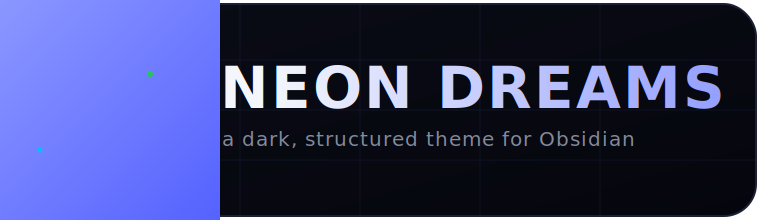
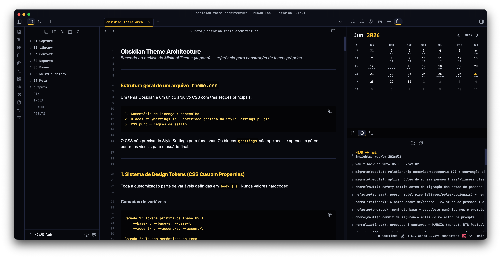
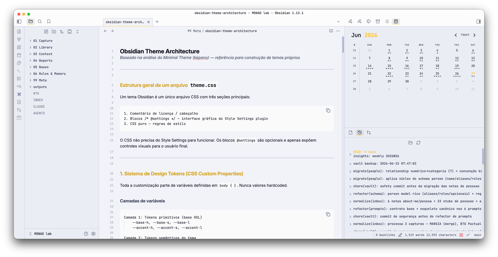
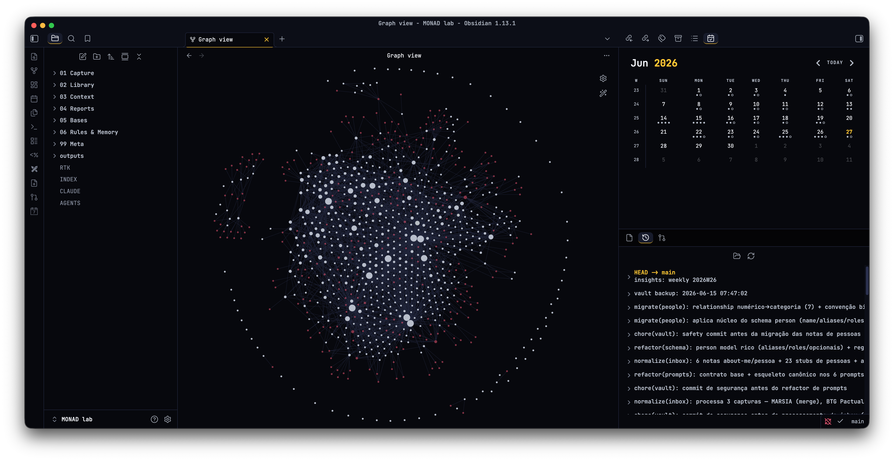
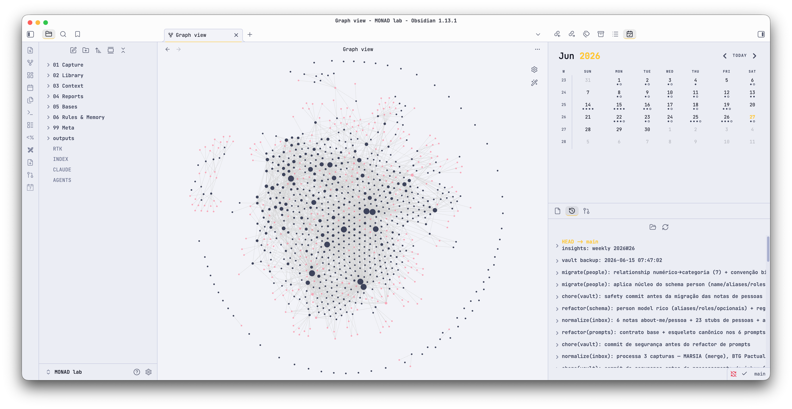

<h1 align="center">Neon Dreams</h1>
<h3 align="center">Personal theme for <a href="https://obsidian.md">Obsidian</a></h3> 

## Preface

A dark Obsidian theme with a precise, structured aesthetic, built for personal knowledge management, journaling, project tracking and markdown-based workflows. Near-black blue backgrounds, structured panels, cool-toned text hierarchy, thin borders and indigo as the default accent.

The entire palette is driven by two HSL hues. Change `--accent-h` and every heading, link, border and interactive element follows -- no manual color picking required.

Please note that I built this theme mostly for myself, so it may not fit every use case.

### If you like the theme

It is completely free, but if you want to throw a few coins in the hat, here is a link.  

## Screenshots

| Dark                                   | Light                                    |
| -------------------------------------- | ---------------------------------------- |
|  |  |
|    |    |

## Main Features

1. **HSL token system.** Change `--base-h` (background hue) and `--accent-h` (accent hue) and the entire palette follows. Every background, border and accent is derived through HSL math. Pick any hue and the theme adapts.
2. **Dark and light variants.** A near-black blue dark theme plus a light variant calculated from the same tokens.
3. **Style Settings integration.** Tweak colors and toggle behaviors without editing CSS (requires the [Style Settings](https://github.com/mgmeyers/obsidian-style-settings) plugin).
4. **Semantic callouts.** Left-border accent per type: cyan for info, green for success, amber for warning, red for danger, muted for quotes. An outlined variant is available.
5. **Task states.** Each `data-task` value gets a distinct checkbox icon and color, natively (no plugin required): `[ ]` todo, `[/]` in progress, `[>]` forwarded, `[?]` question, `[x]` done, `[-]` cancelled.
6. **Tag pills.** Tags render as rounded pills with an indigo tint. A plain text variant is available.
7. **Typography.** Inter for prose, JetBrains Mono for code, metadata, tables and tags. The full heading scale (h1-h6) is configurable through size, weight, style and variant tokens.
8. **Terminal-style code blocks.** Deepest background, accent left border, tinted inline code. Horizontal scroll is available.
9. **Monospace table headers.** Uppercase label style with tabular figures. Full-width and wide layouts are available.
10. **Graph view and Canvas.** Nodes, tags, attachments and unresolved links follow the semantic palette. Canvas cards, edges and focus states use the accent.

## Additional Features

1. Subtle grid overlay on the workspace.
2. Five-level text hierarchy that stays readable in grayscale.
3. Readable line width with independent widths for tables and images.
4. Active line highlight (opt-in).
5. Hide markdown syntax in Live Preview (opt-in).
6. Minimal status bar and auto-hiding ribbon (opt-in).
7. Disable or speed up animations.

---

#### How to use the Style Settings plugin

1. Install the [Style Settings](https://github.com/mgmeyers/obsidian-style-settings) plugin, then enable it.
2. Go to Settings, then open the "Style Settings" tab.

From there you can:

- Set the base hue and saturation (background temperature).
- Set the accent hue and saturation (primary interactive color).
- Enable/disable the active line highlight.
- Hide markdown syntax in Live Preview.
- Show/hide editor line numbers.
- Make code blocks scroll horizontally instead of wrapping.
- Hide the ribbon (show on hover).
- Use a minimal status bar (show on hover).
- Disable or speed up all animations.
- Use square checkboxes.
- Render tags as plain text.
- Use outlined, border-only callouts.
- Strip embed borders and titles.
- Use full-width or wide tables.

---

## Recommended plugins

1. <a href="https://github.com/mgmeyers/obsidian-style-settings">Style Settings</a> (required for the visual controls above).

## Changelog

See [CHANGELOG.md](CHANGELOG.md).
